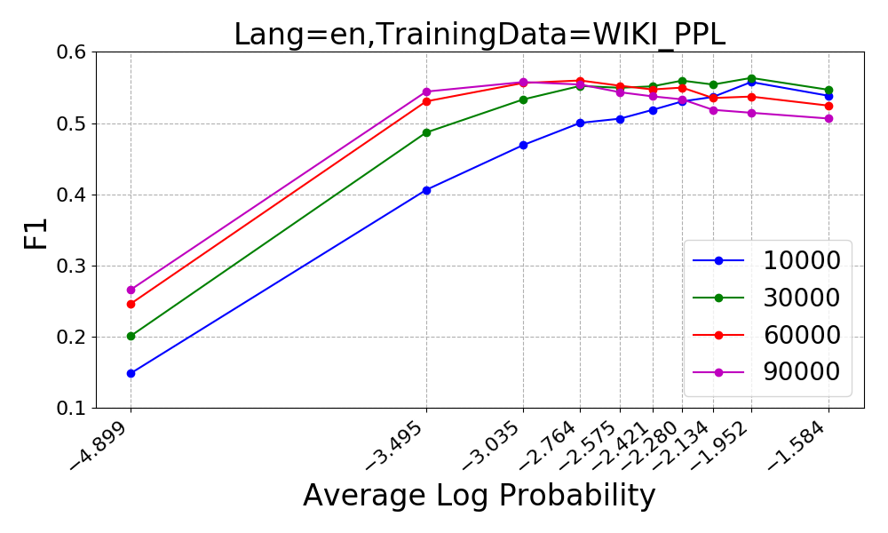
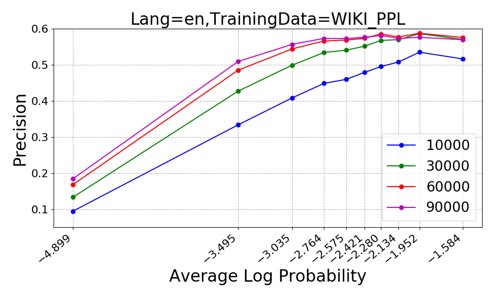
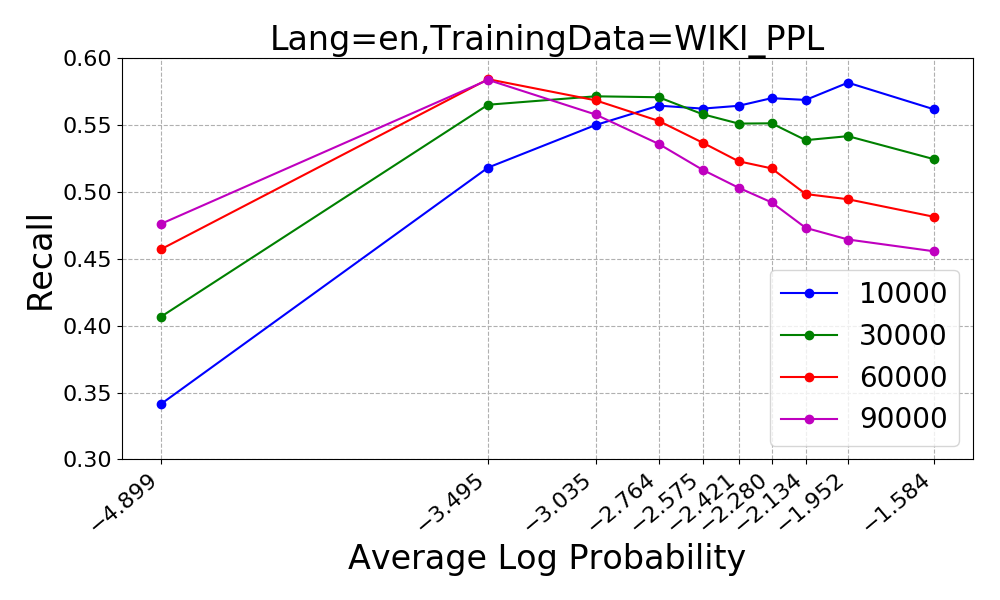

# BPE Segmentation Performance based on Log Probability of Sentence

We trained a [4-gram KenLM](scripts/score_lm.py) to score each sentence,
and then bucket those into 10 buckets based on the log probability (each 
bucket contains the same number of sentences).

The plots of F1, Precision, and Recall can be seen below.

